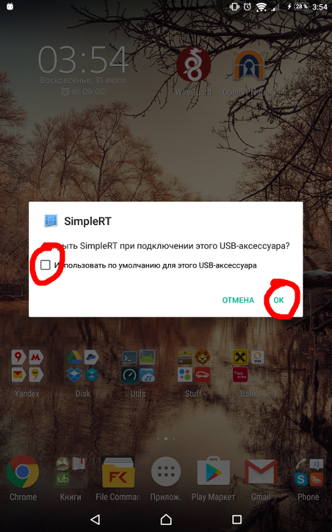
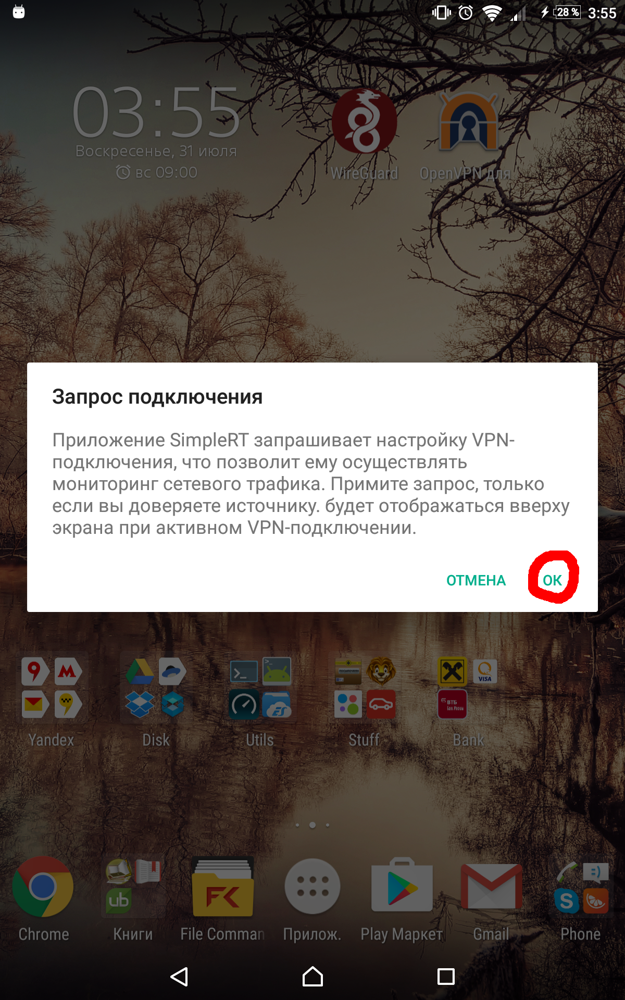

# SimpleRT
Reverse [Tethering](https://en.wikipedia.org/wiki/Tethering) utility for Android.

Allows you to share your computer's internet connection with your Android device via a USB cable.

Development is still in progress, bugs and errors can occur.

```
FIRST RUN: check out -h option
   simple-rt -h
   usage: sudo ./simple-rt [-h] [-i interface] [-n nameserver|"local" ]
   default params: -i eth0 -n 8.8.8.8
```

```
IMPORTANT
   If you have any issues with this tool, please, provide some logs:
   - run util in debug mode (-d), connect your device
   - run "ip addr show"
   - run "ip route show"
   - store this output into issue ticket on github
```

### No root or adb required

## Full Linux and macOS support. Windows version is being researched.

   Current version features:
   - Multi-tether. It is possible to connect several android devices into one virtual network
   - DNS server can be specified (custom or system one).

The SimpleRT utility consists of 2 parts:

- Android part:

   Implemented as a standalone service, no gui, no activities

   Dependencies:
   - Android 4.0 and higher.

   Build system based on gradle + gradle experimental android plugin (supporting ndk). To build, both sdk & ndk are required.
Create local.properties file in root dir, it should look like this:
   ```
   ndk.dir=/home/viper/Android/Sdk/ndk-bundle
   sdk.dir=/home/viper/Android/Sdk
   ```
   build:
   ```
   ./gradlew assembleDebug
   ```
   app/build/outputs/apk/app-debug.apk is your apk.

   ## Now available in [f-droid](https://f-droid.org/repository/browse/?fdfilter=simplert&fdid=com.viper.simplert)
   A prebuilt apk can also be found under `Downloads` at the [Github releases](https://github.com/iteratec/SimpleRT/releases)
   tab.

- Desktop part:

   Dependencies:
   - libusb-1.0
   - libresolv (usually already present in both linux and macos)
   - tuntap kernel module (linux version), utun (macos version, builtin)

   before build (debian-based example):
   ```
   sudo apt install build-essential pkg-config libusb-1.0-0-dev
   ```

   Makefile is universal for all platforms, just type "make && make install" to install it in prefix /usr/local and
   check /usr/local/sbin is in your PATH-variable.  
   If you want to change the prefix path eg. to install it in /usr instead of /usr/local you can
   type "make prefix=/usr && make prefix=/usr install".  
   If you don't want to install but just run it from within build directory you can type "make iface_up_sh_path=.".

Usage:

- run console util as root (sudo simple-rt). The iface_up.sh file needs to be present in the application folder.
- connect your android device

First connection requires some trivial steps:






Issues: Some apps do not recognize the reverse tethered internet connection due to ConnectivityManager policy. Leave the WiFi or mobile data connection active, the connection through SimpleRT will be prioritised.

Partially uses code from [linux-adk](https://github.com/gibsson/linux-adk), which is licensed under the GNU GPLv2 or later. This project is under the GNU GPLv3 or later.

##### License: GNU GPL v3

```
SimpleRT: Reverse tethering utility for Android
Copyright (C) 2016 Konstantin Menyaev

This program is free software: you can redistribute it and/or modify
it under the terms of the GNU General Public License as published by
the Free Software Foundation, either version 3 of the License, or
(at your option) any later version.

This program is distributed in the hope that it will be useful,
but WITHOUT ANY WARRANTY; without even the implied warranty of
MERCHANTABILITY or FITNESS FOR A PARTICULAR PURPOSE.  See the
GNU General Public License for more details.

You should have received a copy of the GNU General Public License
along with this program.  If not, see <http://www.gnu.org/licenses/>.
```
